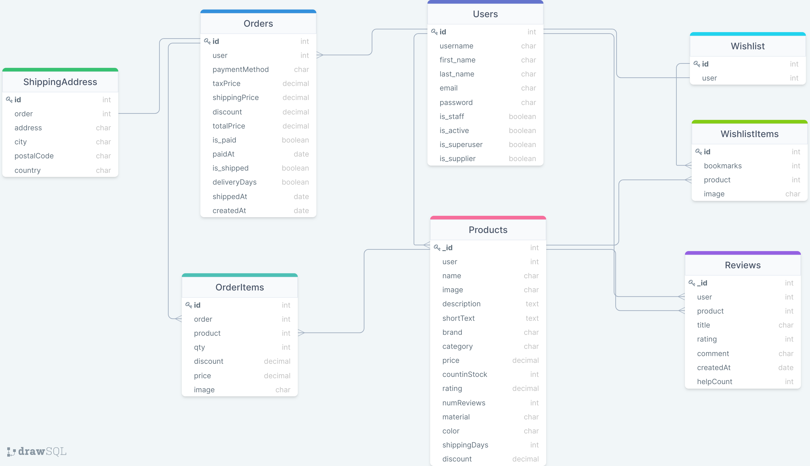

# Alluviart- An Ecommerce Website

A project that builds a demo version of an ecommerce website with Django REST framework for backend and React for frontend.
For practice purpose only.

# Demo HomePage

# Installation

## Django

    1 - Clone project: git clone https://github.com/PhamNam176/Alluviart.git
    2 - cd Alluviart
    3 - Create virtual environment: virtualenv myenv
    4 - myenv\scripts\activate
    5 - pip install -r requirements.txt
    6 - python manage.py runserver

## React

    1 - cd frontend
    2 - npm install

# Features

    1 - User Authentication, User Profile Page
    2 - Product Detail, Product Search, Product Pagination
    3 - Shopping Cart (Create, Retrieve, List)
    4 - Checkout Process
    5 - Wishlist (upcoming)
    6 - Customer Review (upcoming)

# Data Model

